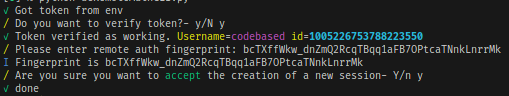

# smallscripts
A collection of scripts and otherwhise user interactible programs meant to accomplish
a task and quit.  
They are usually made to accomodate a specific usecase and are
quickly put together without much thought and thus do not deserve a separate repo.  
Some **may** be branched out (along with respective commit history) which will
be approprietly linked (and marked with 🌱)
# TOC
Legend: 📁 - Folder  ⚙️ - Script/Program ⭐ - Polished content 🌱 - Branched out into own repo
- 📁 [Python](#Python)
    - 📁 [CLI wrappers](#CLI-wrappers)
        - ⚙️ [Discord Remote Auth](#discord-remote-auth)

# Python
## CLI wrappers
### Discord Remote Auth
This is a simple script wrapper for the "remote-auth" discord protocol.
It lets you generate a new discord session on command.
It was made quickly and is very crude and not very clean.

Docs on the protocol: https://github.com/discord-userdoccers/discord-userdoccers/blob/master/pages/remote-authentication/mobile.mdx

Meant to be a fully interactive CLI program with the typical flow as follows:
